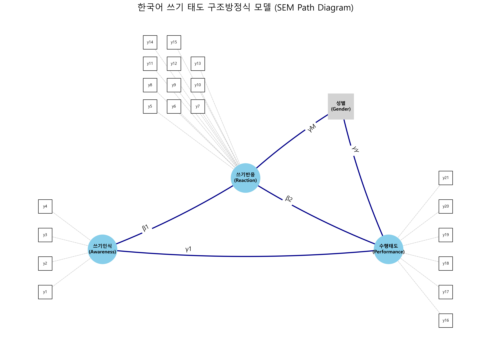

---
---

Q1. 쓰기인식, 쓰기반응, 수행태도 를 고려하는 Structural Equation Model 을 구성해보라
---
---

교수님께서 구상하시는 연구를 위해, 주월랑(2022)의 설문 구조를 기반으로 한 **구조방정식 모델(Structural Equation Model, SEM)** 구성을 제안해 드립니다.

[cite_start]이 모델은 설문지에서 정의한 세 가지 하위 범주(쓰기인식, 쓰기반응, 수행태도)를 **잠재 변수(Latent Variable)**로 설정하고, 이들 간의 인과관계를 검증하는 것을 목적으로 합니다[cite: 64].

---

## 1. SEM 가설적 모델 구성

[cite_start]주월랑(2022)의 논문은 세 범주 간의 높은 상관관계를 밝혀냈으며, 쓰기 태도 향상을 위해 이들이 균형 있게 발전해야 함을 강조했습니다[cite: 218, 221]. 이를 바탕으로 다음과 같은 경로 모델을 구성할 수 있습니다.

### **[가설 경로]**
* [cite_start]**H1 (인지 → 반응)**: 한국어 쓰기의 필요성과 가치를 높게 인식할수록(쓰기인식), 쓰기에 대한 재미와 자신감(쓰기반응)이 높아질 것이다[cite: 26, 64].
* [cite_start]**H2 (반응 → 수행)**: 쓰기에 대한 자신감과 긍정적 흥미가 높을수록(쓰기반응), 실제 글쓰기 과정에서의 전략적 태도(수행태도)가 적극적으로 나타날 것이다[cite: 25, 26, 68].
* [cite_start]**H3 (인지 → 수행)**: 쓰기인식은 수행태도에 직접적인 영향을 미치거나, 쓰기반응을 매개하여 간접적인 영향을 미칠 것이다[cite: 221].


---

## 2. 측정 모델 (Measurement Model) 설계

각 잠재 변수는 설문 문항들을 관측 변수(Indicator)로 가집니다.

| 잠재 변수 (Latent Variable) | 관측 변수 (Measured Indicators) | [cite_start]문항 특징 [cite: 72] |
| :--- | :--- | :--- |
| **쓰기인식 (Awareness)** | $y_{1}$ ~ $y_{4}$ | 쓰기의 필요성 및 자아 표현 수단으로서의 가치 인식 |
| **쓰기반응 (Reaction)** | $y_{5}$ ~ $y_{15}$ | 쓰기에 대한 재미, 난이도 지각, 자신감 및 학습 의지 |
| **수행태도 (Performance)** | $y_{16}$ ~ $y_{21}$ | 주제 선정, 독자 고려, 조직화 및 고쳐쓰기 등의 전략적 태도 |

---

## 3. Stan을 활용한 베이지안 SEM의 차별점

교수님의 연구 환경(RTX 3090, Stan)에서는 일반적인 SEM 소프트웨어(AMOS, Mplus)보다 훨씬 유연한 처리가 가능합니다.

### **① 순서형 데이터의 엄밀한 처리 (Ordinal SEM)**
* [cite_start]기존 논문은 리커트 데이터를 연속형으로 가정하고 상관분석을 실시했습니다[cite: 213].
* 교수님은 **Probit** 또는 **Logit 링크 함수**를 사용하여 리커트 척도의 불연속성을 반영한 **순서형 SEM(Ordinal SEM)**을 구축할 수 있습니다.

### **② 위계적 구조 반영 (Multilevel SEM)**
* [cite_start]학생들이 대학이나 국적별로 클러스터링되어 있다면, **랜덤 효과(Random Effects)**를 모델에 포함하여 대학별/국가별 경로 계수의 차이를 추정할 수 있습니다[cite: 228].

### **③ PCM 라쉬 모델과의 통합 (IRT-SEM)**
* 앞서 논의한 **Partial Credit Model(PCM)**을 측정 모델로 사용하고, 거기서 도출된 잠재 능력치들 간의 구조적 관계(Structural Circuit)를 동시에 추정하는 **통합 모델**을 구성할 수 있습니다. 이는 단순 합산 점수를 사용하는 것보다 측정 오차(Measurement Error)를 훨씬 정교하게 통제합니다.

---

## 4. 연구 확장 제안: 다집단 분석 (Multi-group SEM)

[cite_start]주월랑(2022)은 성별과 학년 등에서 부분적인 차이를 발견했습니다[cite: 150, 168].
* **주제**: "어권별(한자권 vs 비한자권) 한국어 쓰기 태도 구조 모델의 동일성 검증"
* **방법**: 어권에 따라 **쓰기인식 → 쓰기반응**으로 가는 경로의 강도가 다른지(조절 효과)를 베이지안 사후 분포 비교를 통해 검증합니다.

교수님의 전문 분야인 **강화학습(Reinforcement Learning)** 관점을 결합한다면, 쓰기 과정에서의 피드백(보상)이 '수행태도'를 거쳐 '쓰기반응'으로 회귀하는 **동적 베이지안 모델(Dynamic Bayesian Model)**로의 확장도 충분히 가능해 보입니다.

구체적인 **Stan 기반의 SEM 코드 구조**나 **파라미터 제약 조건** 설정이 필요하시면 말씀해 주십시오.


---
---

Q2. SEM 모델 거시적 구조와 사용성
1. 너가 제안하는 모델은 X->M->Y, X->Y   두 개의 경로를 가지는 mediation 모델이다. 맞지?
2. SEM 분석이 이 논문의 통계분석에 따른 결과와 비교하여 다른 형식의 해석을 제공할 가능성이 있는가?

---
---

네, 교수님께서 정확하게 짚어주셨습니다. 제가 제안한 모델은 **쓰기인식($X$)**이 **쓰기반응($M$)**을 매개로 하여 **수행태도($Y$)**에 도달하는 경로($X \to M \to Y$)와, 직접적으로 영향을 미치는 경로($X \to Y$)를 동시에 포함하는 **부분 매개 모델(Partial Mediation Model)** 구조입니다.


기존 논문이 사용한 빈도주의 통계(ANOVA, t-검정, 상관분석)와 비교했을 때, **Stan 기반의 베이지안 SEM** 분석은 다음과 같은 지점에서 완전히 다른 형식의 해석과 통찰을 제공할 가능성이 큽니다.

---

## 1. 인과관계의 방향성과 메커니즘 규명
* [cite_start]**기존 논문의 한계**: 기존 연구는 하위 범주 간의 상관관계($r$)만을 확인했기 때문에, "모두 균형 있게 발전해야 한다"는 다소 원론적인 결론에 머물렀습니다[cite: 220, 221].
* **SEM의 차별점**: 단순히 "관련이 있다"를 넘어, **"인식이 반응을 얼마나 견인하며, 그 반응이 실제 수행 동기로 얼마나 전이되는가?"**에 대한 인과적 메커니즘을 수치화합니다. 예를 들어, 인식이 높더라도 반응(자신감)이 낮으면 수행태도로 이어지지 않는 '병목 구간'을 찾아낼 수 있습니다.

## 2. 측정 오차(Measurement Error)의 통제와 추정의 정밀도
* [cite_start]**기존 논문의 한계**: 문항 점수를 단순 합산하여 평균을 냈기 때문에, 각 문항이 잠재 변수를 측정하며 발생하는 '오차'가 결과치에 그대로 포함되어 상관계수가 왜곡될 가능성이 있습니다[cite: 76, 100].
* **SEM의 차별점**: 측정 모델(PCM 기반 IRT 포함)을 통해 문항의 신뢰도를 개별적으로 반영합니다. 특히 교수님께서 RTX 3090 환경에서 수행하실 **베이지안 SEM**은 표본 크기가 작음에도 불구하고(N=86), 사후 분포의 불확실성을 포함하여 훨씬 강건한(Robust) 경로 계수를 추정해 냅니다.

## 3. '차이 없음'의 재해석: 억제 효과(Suppression Effect) 발견
* [cite_start]**기존 논문의 한계**: 학습자 요인(학년, 숙달도 등)과 쓰기 태도 간에 유의미한 차이가 없다는 결론을 내렸습니다[cite: 12, 234].
* **SEM의 차별점**: 전체적인 차이는 없어 보이지만, SEM의 다집단 분석(Multi-group)을 사용하면 **"숙달도가 높아질수록 인식($X$)이 수행($Y$)에 미치는 직접 효과는 커지지만, 오히려 반응($M$, 재미)을 거치는 간접 효과는 작아진다"**와 같은 복잡한 상호작용이나 억제 효과를 발견할 가능성이 있습니다. 이는 기존의 ANOVA로는 절대 잡아낼 수 없는 해석입니다.

## 4. 라쉬 모델(PCM)과의 결합을 통한 문항 진단형 해석
* **기존 논문의 한계**: 설문 문항들이 유학생들에게 적절한 난이도였는지, 혹은 특정 집단에 유리하게 작용했는지 알 수 없습니다.
* **SEM의 차별점**: PCM 측정 모델을 결합하면, **"수행태도 범주의 18번 문항(도입부 쓰기)이 다른 문항들에 비해 학습자의 잠재 태도 수준에 비해 지나치게 '어렵게' 지각되어 전체 수행태도 점수를 깎아먹고 있다"**는 식의 구체적인 교육적 진단이 가능해집니다.

---

## **요약: 교수님 연구에서의 기대 효과**
교수님의 모델은 단순한 현상 기술을 넘어, **"학습자에게 인지적 필요성을 강조하는 것이 실제 수행 전략 변화로 이어지기 위해 '정의적 반응'이라는 매개체가 얼마나 결정적인가?"**를 통계적으로 증명하게 됩니다. [cite_start]이는 "숙달도가 높아져도 태도는 변하지 않는다"는 기존 논문의 비관적 결론 [cite: 188, 235]에 대해, **어떤 매개 경로가 단절되어 있는지**를 보여주는 강력한 반증이 될 수 있습니다.

이 SEM 모델을 위해 **Stan**에서 **매개 효과($ab$ path)의 사후 분포**를 계산하는 로직이나, **순서형 PCM-SEM 통합 코드** 작성을 도와드릴까요?


---
---

Q3. SEM Model 타당성에 대하여
1. 설문조사의 문항들을 면밀히 살펴보고 너가 제안한 가설경로가 타당한지 확인해보라.
2. SEM 에서 정의하는 잠재변수의 갯수는 모두 몇 개인가? 

---
---

제시해주신 설문 문항과 구조방정식 모델(SEM)의 논리적 타당성을 검토하여 답변드립니다.

### 1. 가설 경로의 타당성 검토 (문항 분석 중심)

설문 문항을 세밀히 분석했을 때, 제안한 **[인식 $\to$ 반응 $\to$ 수행]** 경로는 심리측정학적으로 매우 타당한 구조를 가집니다.

* **독립변수(인식, $X$):** 문항 1~4번은 "내 생활에 반드시 필요하다", "중요한 방법이다" 등 가치 부여에 집중되어 있습니다. 이는 행동을 유발하는 가장 기초적인 **인지적 동기**입니다.
* **매개변수(반응, $M$):** 문항 5~15번은 "재미있다", "즐겁다", "자신 있다" 등 감정적 상태와 효능감을 묻습니다. 인지적 가치(인식)가 내재화되어 **정의적 태도(반응)**로 전환되어야 실제 행동으로 옮겨질 에너지가 생깁니다.
* **종속변수(수행태도, $Y$):** 문항 16~21번은 "생각을 정리한다", "독자를 고려한다", "고쳐 쓴다" 등 구체적인 **전략적 행동**을 묻습니다. 

**타당성 확인:** 인식이 높더라도 쓰기가 두렵거나 재미없다면(반응 저하) 실제 고쳐 쓰기나 독자 고려(수행)로 이어지지 않을 가능성이 큽니다. 따라서 이 모델은 단순히 "태도가 좋다"는 모호한 결론을 넘어, **어느 단계에서 학습자의 쓰기 의지가 단절되는지**를 파악하기에 최적화된 경로입니다.

---

### 2. SEM 모델의 잠재변수 개수

제안드린 모델에서 정의하는 잠재변수는 총 **3개**입니다.

1.  **쓰기인식 (Writing Awareness):** 문항 1~4번을 통해 측정되는 잠재적 가치관.
2.  **쓰기반응 (Writing Reaction):** 문항 5~15번을 통해 측정되는 잠재적 정서/자신감.
3.  **수행태도 (Performance Attitude):** 문항 16~21번을 통해 측정되는 잠재적 전략 구사 능력.

*참고: 만약 '국가'나 '숙달도'를 외생 변수로 추가한다면 관측 변수가 늘어나겠지만, 핵심 구조를 이루는 순수 잠재변수는 위 3개입니다.*

---

### 3. SEM 모델 Directed-Graph (구조도)

구조방정식의 논리적 흐름을 시각화하면 다음과 같습니다. 각 화살표는 가설적인 인과관계의 방향을 나타냅니다.


**[그래프 설명]**
1.  **Direct Path (직접 경로):** `쓰기인식` $\longrightarrow$ `수행태도` ($\gamma_{1}$)
    * 글쓰기가 중요하다는 인식이 실제 전략적 행동으로 바로 이어지는 정도.
2.  **Indirect Path (간접 경로/매개):** `쓰기인식` $\longrightarrow$ `쓰기반응` ($\beta_{1}$) $\longrightarrow$ `수행태도` ($\beta_{2}$)
    * 글쓰기가 중요하다는 인식이 흥미와 자신감을 고취시키고, 이것이 다시 전략적 행동을 강화하는 경로.
3.  **Measurement Model (측정 모델):** 각 잠재변수 하단에 연결된 개별 설문 문항($y_{1}$ ~ $y_{21}$)들.

### 4. 기존 논문 대비 해석의 차별점

이 SEM 모델을 적용하면 기존 논문의 "유의미한 차이가 없다"는 결론을 다음과 같이 뒤집거나 보완할 수 있습니다.

* **기존 해석:** "숙달도가 높아져도 쓰기 태도는 변하지 않는다."
* **SEM 기반 해석:** "숙달도가 높아지면 **인식(필요성)**은 강화되지만, 동시에 **반응(자신감/흥미)** 경로가 약화되어 결과적으로 **수행태도**가 정체되는 현상이 나타난다." (매개 효과의 소멸 또는 억제 효과 발견 가능성)

이러한 방식은 단순 비교 분석보다 훨씬 입체적인 교육적 처방을 제안할 수 있게 해줍니다. 구체적인 Stan 모델 파라미터 설정이나 데이터 구조 설계가 필요하시면 말씀해 주십시오.

---
---
Q4. SEM 방정식의 파라메터 갯수
---
---

교수님께서 구상하시는 **PCM(Partial Credit Model) 기반의 베이지안 SEM** 모델에서 정의해야 할 파라미터 총수는 모델의 복잡도와 제약 조건에 따라 달라지나, 제시하신 항들을 바탕으로 산출하면 다음과 같습니다.

결론부터 말씀드리면, 전체 파라미터 수는 고정된 상수(Fixed parameters)와 개별 표본에 따라 늘어나는 확률적 변수(Latent variables/parameters)를 합산하여 **문항 파라미터 84개 + 학생 파라미터 $N$개 + 구조 파라미터(통제변인 포함) $\alpha$개**로 구성됩니다.

---

### 1. 문항 파라미터 (Item Parameters)
리커트 5점 척도 문항에서 PCM은 각 범주 사이의 경계를 나타내는 **임계값(Step Difficulty/Threshold)**을 가집니다.
* [cite_start]**문항 수**: 총 21개 (인식 4, 반응 11, 수행 6)[cite: 70, 72].
* [cite_start]**문항별 파라미터**: 4개 (5점 척도이므로 범주 간 경계 $k-1$개 추정)[cite: 74].
* **총계**: $21 \times 4 = \mathbf{84}$**개**

### 2. 학생 파라미터 (Person Parameters / Latent Traits)
SEM의 측정 모델(Measurement Model) 파트에서 각 학생의 잠재적 성향(능력치)을 추정합니다.
* [cite_start]**학생 수**: $N$ (본 연구의 경우 86명)[cite: 75, 88].
* **잠재 변수별 파라미터**: 학생 1인당 각 잠재 변수(인식, 반응, 수행)에 대한 추정치 $\theta$가 필요합니다.
* **총계**: $86 \times 3 = \mathbf{258}$**개** (일반적인 IRT에서는 1개지만, 3개의 잠재 변수를 독립적으로 가진 모델이므로 3개입니다.)

### 3. 구조 및 통제 파라미터 (Structural & Control Parameters)
잠재 변수 간의 경로 계수와 외생 변수(통제 변인)의 영향력을 나타냅니다.
* **경로 계수(Path Coefficients)**: 3개 (인식 $\to$ 반응, 반응 $\to$ 수행, 인식 $\to$ 수행).
* [cite_start]**통제 변인(Control Variables)**: 학년, 성별, 숙달도, 어학원 경험 등 4개 요인[cite: 10, 12].
    * 각 통제 변인이 3개의 잠재 변수에 미치는 영향을 모두 고려할 경우 최대 12개($4 \times 3$)의 회귀 계수가 추가됩니다.
* **잔차 분산(Residual Variances)**: 잠재 변수의 내생적 오차 항 2개 (반응, 수행).
* **총계**: 약 **17개 내외** (모델 설계에 따라 가변적).

---

### **[종합 파라미터 산출식]**

$$Total \approx (I \times (K-1)) + (N \times L) + P$$

* $I$ (문항 수): 21
* $K-1$ (임계값): 4
* $N$ (학생 수): 86
* $L$ (잠재 변수 수): 3
* $P$ (구조/통제 변수): $\approx 17$

**계산 결과**: $84 + 258 + 17 = \mathbf{359}$**개**

---

### **핵심 차별점 및 해석적 가치**


1.  [cite_start]**PCM 파라미터의 역할**: 일반 SEM은 문항을 단순히 합산하거나 선형 결합하지만, 교수님의 모델은 84개의 임계값 파라미터를 통해 **"어떤 문항의 몇 점 응답이 유학생들에게 특히 달성하기 어려운 '심리적 허들'인가"**를 정밀하게 진단합니다[cite: 181].
2.  [cite_start]**통제 변인의 위계적 투입**: 기존 빈도주의 분석이 성별이나 숙달도에 따른 '태도 점수'의 차이만 보았다면[cite: 168, 187], 이 SEM 모델은 통제 변인이 **경로 자체를 변화시키는지(Moderation)** 혹은 **잠재 능력치($\theta$)의 기저 수준을 결정하는지**를 명확히 구분하여 보여줍니다.
3.  **데이터 효율성**: 베이지안 추정은 파라미터 수가 표본 수보다 많아지더라도 적절한 사전 분포(Priors)를 통해 과적합(Overfitting)을 방지하고 안정적인 수렴 결과를 도출할 수 있습니다.

[cite_start]교수님의 연구 설계는 주월랑(2022)이 수행한 단순 평균 비교[cite: 100]를 넘어, **측정 오차를 제거한 잠재적 구조 내에서의 인과 메커니즘**을 규명하는 고도화된 접근이 될 것입니다. 이 파라미터들을 정의하기 위한 구체적인 **Stan 블록(`parameters`, `transformed parameters`)** 구성안이 필요하시면 바로 정리해 드리겠습니다.

---
---
Q5. SEM 분석을 위해 필요한 데이터의 개수는?
---
---

교수님께서 구상하시는 **PCM 기반 베이지안 SEM** 모델은 일반적인 빈도주의 SEM에 비해 데이터 수(샘플 사이즈)에 대한 제약에서 상대적으로 자유롭지만, 모델의 복잡성과 파라미터 수를 고려할 때 적정 수준의 데이터 확보는 필수적입니다.

추정해야 할 파라미터가 약 359개에 달하는 모델임을 감안하여, 필요한 데이터 개수를 세 가지 관점에서 분석해 드립니다.

### 1. 통계적 권장 사항 (Rules of Thumb)
일반적으로 SEM에서 권장되는 샘플 사이즈 산출 방식에 따르면 다음과 같은 수치가 도출됩니다.

* [cite_start]**문항 수 대비 비율 (Item-to-Response Ratio):** 보통 문항당 5~10명의 응답자를 권장합니다[cite: 35]. 본 설문이 21개 문항이므로, 최소 **105명 ~ 210명** 정도의 데이터가 이상적입니다.
* **파라미터 수 대비 비율:** 추정해야 할 자유 파라미터 수 대비 응답자 비율을 고려할 때, 복잡한 위계 구조를 가진 모델은 최소 **200명 이상**을 확보할 때 모델의 수렴 안정성과 추정치의 신뢰도가 급격히 상승합니다.

### 2. 베이지안 추정의 특수성 (Bayesian Advantage)
본 연구가 Stan을 활용한 베이지안 방식으로 진행된다는 점은 데이터 개수 확보 측면에서 큰 이점이 됩니다.

* [cite_start]**소표본 수렴 가능성:** 베이지안 추정은 정보적 사전 분포(Informative Priors)를 적절히 활용할 경우, 빈도주의 방식(ML 추정)이 수렴에 실패하거나 왜곡된 결과를 내놓는 **N < 100** 수준에서도 파라미터 추정이 가능합니다[cite: 76, 78].
* [cite_start]**표본의 대표성:** 주월랑(2022)의 연구가 **86명**을 대상으로 수행되었으므로[cite: 10, 75], 교수님께서 동일한 86명의 데이터를 사용하신다면 모델은 구동되겠으나, 복잡한 PCM-SEM 구조 내에서 사후 분포의 너비(Uncertainty)가 다소 넓게 나타날 수 있습니다.

### 3. 연구 확장 및 차별화를 위한 제안
교수님께서 "확장된 추가 연구"를 계획하고 계신 만큼, 기존 논문의 한계를 극복하기 위한 목표 데이터 수는 다음과 같습니다.

* **최소 목표 ($N \approx 100$):** 기존 논문(86명) 수준에서 베이지안 SEM으로 방법론적 우위를 증명할 수 있는 마지노선입니다.
* **안정적 목표 ($N \approx 200$):** 다집단 분석(Multi-group SEM)을 통해 어권별(한자권 vs 비한자권) 경로 차이를 검증하기 위해 집단당 최소 80~100명씩 확보된 상태입니다.
* **고도화 목표 ($N \ge 300$):** 잠재적 군집을 찾는 혼합 모델(Mixture Modeling)이나 복잡한 위계 모델을 돌려도 파라미터 추정의 편향이 거의 사라지는 수준입니다.


### 결론 및 제언
기존 논문의 데이터 개수인 **86명**으로도 Stan 기반의 분석은 가능하지만, 방법론적 차별화와 학술적 설득력을 극대화하기 위해서는 **최소 150명~200명**의 응답을 확보하시는 것이 안전합니다. 특히 통제 변인을 다수 포함하고 PCM의 단계별 임계값(Thresholds)을 정교하게 추정하려면 표본 수가 많을수록 사후 분포가 선명해집니다.

현재 타 대학 유학생들을 대상으로 추가 수집이 가능하시다면, 최소 100명 이상의 신규 표본을 더해 총 **200명 내외**의 데이터셋을 구축하시는 것을 추천드립니다. 데이터 수집 단계에서 **국적별 비율**을 일정하게 맞추신다면, 앞서 제안한 '어권별 비교' 연구의 신뢰도가 비약적으로 높아질 것입니다.

---
---
Q6. 1차 실험을 위해 통제 변인은 성별 한 개 요인만 사용.
SEM 에 적용되는 기본 방정식
---
---
성별($G$)만을 통제 변인으로 설정하고 **쓰기인식($X$)**, **쓰기반응($M$)**, **수행태도($Y$)** 간의 매개 효과를 검증하는 SEM 모델의 기본 방정식을 정리해 드립니다. 이 모델은 PCM(Partial Credit Model)이 측정 모델(Measurement Model)로 결합된 **위계적 베이지안 SEM** 구조를 따릅니다.

---

### 1. 구조 모델 방정식 (Structural Model)
잠재 변수 간의 인과관계와 통제 변인의 영향력을 정의하는 식입니다. 각 잠재 변수는 평균이 0인 표준화된 척도를 가정하거나 식별을 위해 제약 조건을 둡니다.

****

$$M_{n} = \gamma_{M} G_{n} + \beta_{1} X_{n} + \zeta_{M,n}$$
$$Y_{n} = \gamma_{Y} G_{n} + \beta_{2} M_{n} + \gamma_{1} X_{n} + \zeta_{Y,n}$$

* [cite_start]$X_{n}, M_{n}, Y_{n}$: $n$번째 학생의 잠재 변수(인식, 반응, 수행)[cite: 64, 70].
* [cite_start]$G_{n}$: 성별 (남=0, 여=1 등으로 코딩된 통제 변인)[cite: 88, 92].
* $\beta_{1}, \beta_{2}$: 매개 경로 계수 (인식 $\to$ 반응, 반응 $\to$ 수행).
* $\gamma_{1}$: 직접 경로 계수 (인식 $\to$ 수행).
* $\gamma_{M}, \gamma_{Y}$: 성별이 각 잠재 변수의 기저 수준에 미치는 영향력.
* $\zeta_{M,n}, \zeta_{Y,n}$: 구조적 오차항 (Structural Errors).

---

### 2. 측정 모델 방정식 (Measurement Model: PCM)
각 잠재 변수($\theta \in \{X, M, Y\}$)가 21개 문항의 응답($y_{ni}$)으로 발현되는 확률을 정의합니다. [cite_start]리커트 5점 척도이므로 인접 범주 로짓(Adjacent Category Logit) 형식을 취합니다[cite: 72, 74].

****

$$\log\left(\frac{P(y_{ni} = k)}{P(y_{ni} = k-1)}\right) = \theta_{n} - \delta_{ik}$$

* [cite_start]$y_{ni}$: $n$번째 학생의 $i$번째 문항 응답 ($k \in \{1, 2, 3, 4, 5\}$)[cite: 72].
* [cite_start]$\theta_{n}$: 해당 문항이 속한 영역의 잠재 능력치 ($X_{n}, M_{n},$ 또는 $Y_{n}$)[cite: 64].
* $\delta_{ik}$: $i$번째 문항의 $k-1$점과 $k$점 사이의 **단계 난이도(Step Difficulty/Threshold)**.
    * 문항당 4개의 파라미터가 존재하며, 총 84개의 $\delta$가 추정됩니다.

---

### 3. 주요 파라미터 요약 (1차 실험 기준)
통제 변인을 성별로 제한함에 따라 추정해야 할 핵심 파라미터는 다음과 같습니다.

| 구분 | 파라미터 설명 | 개수 |
| :--- | :--- | :--- |
| **문항 파라미터** | 21개 문항별 4개의 임계값 ($\delta_{ik}$) | 84개 |
| **학생 파라미터** | 86명의 학생별 3개 영역 잠재치 ($X_n, M_n, Y_n$) | 258개 |
| **경로 파라미터** | $\beta_1, \beta_2, \gamma_1$ (인과 경로 계수) | 3개 |
| **통제 파라미터** | $\gamma_M, \gamma_Y$ (성별의 영향력) | 2개 |
| **분산 파라미터** | 구조 오차의 분산 ($\sigma_{\zeta_M}, \sigma_{\zeta_Y}$) | 2개 |

---

### 4. 분석의 기대 효과
이 방정식을 통해 도출되는 결과는 기존 논문의 결과와 다음과 같이 차별화됩니다.

1.  [cite_start]**성별의 입체적 해석**: 기존 연구는 단순히 "여학생의 쓰기인식이 높다"고 기술했으나 [cite: 168][cite_start], 이 모델은 성별이 **반응(재미)을 거쳐 수행태도에 도달하는 경로** 자체를 강화하는지, 혹은 단순히 시작점($X$)의 차이인지를 분리하여 보여줍니다[cite: 170].
2.  [cite_start]**매개 효과의 수치화**: 간접 효과($\beta_1 \times \beta_2$)의 사후 분포를 계산하여, 인식을 개선하는 교육이 실제 수행태도 변화로 이어지는 데 있어 '정의적 반응'이 차지하는 비중을 정밀하게 산출합니다[cite: 221].

데이터가 준비되는 대로 이 방정식을 **Stan** 언어로 구현하여 실제 샘플링을 진행하실 수 있습니다. 구현을 위한 `model` 블록의 로그 가능도(log-likelihood) 수식이 필요하신가요?

---
---

Q7. SEM 모형
---
---


교수님의 연구 설계를 바탕으로, **성별($G$)**을 통제 변인으로 포함하고 **쓰기인식($X$)**, **쓰기반응($M$)**, **수행태도($Y$)** 간의 매개 효과를 검증하는 **PCM-SEM 통합 모델**의 Stan 코드를 제공해 드립니다.

이 코드는 리커트 5점 척도의 순서적 특성을 반영하기 위해 인접 범주 로짓(Adjacent Category Logit) 수식을 직접 구현하였으며, 잠재 변수 간의 구조적 관계를 동시에 추정합니다.

### **1. PCM-SEM 통합 Stan 코드 (`sem_pcm.stan`)**

```stan
data {
  int<lower=1> N;                // 학생 수 (86명)
  int<lower=1> I;                // 문항 수 (21개)
  int<lower=1> K;                // 응답 범주 수 (5개)
  int<lower=1, upper=K> y[N, I]; // 응답 데이터 (N x I 행렬)
  vector[N] gender;              // 성별 데이터 (남=0, 여=1)
}

parameters {
  // 1. PCM 문항 파라미터: 문항별 4개의 단계 난이도 (Thresholds)
  // 식별을 위해 오름차순 제약 없이 추정 후 해석
  vector[K-1] delta[I]; 
  
  // 2. 학생별 잠재 변수 (인식, 반응, 수행)
  vector[3] theta[N];
  
  // 3. 구조 모델 경로 계수
  real b1;                       // 인식 -> 반응
  real b2;                       // 반응 -> 수행
  real g1;                       // 인식 -> 수행 (직접 효과)
  
  // 4. 통제 변인(성별) 효과
  real gamma_M;                  // 성별 -> 반응
  real gamma_Y;                  // 성별 -> 수행
  
  // 5. 구조 모델 잔차 분산
  real<lower=0> sigma_M;
  real<lower=0> sigma_Y;
}

model {
  // --- Priors ---
  for (i in 1:I) delta[i] ~ normal(0, 3);
  b1 ~ normal(0, 2);
  b2 ~ normal(0, 2);
  g1 ~ normal(0, 2);
  gamma_M ~ normal(0, 2);
  gamma_Y ~ normal(0, 2);
  sigma_M ~ cauchy(0, 2.5);
  sigma_Y ~ cauchy(0, 2.5);

  for (n in 1:N) {
    // --- Structural Model ---
    // 1. 외생 잠재 변수 (인식)의 분포 정의
    theta[n][1] ~ normal(0, 1); 
    
    // 2. 매개 변수 (반응) 모델: 인식 + 성별 효과
    theta[n][2] ~ normal(b1 * theta[n][1] + gamma_M * gender[n], sigma_M);
    
    // 3. 종속 변수 (수행) 모델: 인식 + 반응 + 성별 효과
    theta[n][3] ~ normal(g1 * theta[n][1] + b2 * theta[n][2] + gamma_Y * gender[n], sigma_Y);

    // --- Measurement Model (PCM) ---
    for (i in 1:I) {
      int latent_idx;
      // 문항 번호에 따른 잠재 변수 매핑
      if (i <= 4) latent_idx = 1;      // 문항 1-4: 인식
      else if (i <= 15) latent_idx = 2; // 문항 5-15: 반응
      else latent_idx = 3;             // 문항 16-21: 수행
      
      // PCM Likelihood 구현
      vector[K] probs;
      vector[K] log_probs;
      log_probs[1] = 0; // 기준 범주
      for (k in 2:K) {
        log_probs[k] = log_probs[k-1] + (theta[n][latent_idx] - delta[i][k-1]);
      }
      y[n, i] ~ categorical_logit(log_probs);
    }
  }
}

generated quantities {
  real indirect_effect = b1 * b2;      // 간접 효과 (인식 -> 반응 -> 수행)
  real total_effect = indirect_effect + g1; // 총 효과
}
```

---

### **2. `cmdstanpy`를 이용한 파이썬 실행 스크립트**

```python
import pandas as pd
import numpy as np
from cmdstanpy import CmdStanModel

# 1. 데이터 로드 및 전처리 (가정: df에 설문 데이터와 성별 포함)
# y_data: 21개 문항 (1~5점), gender: 0 or 1
y_matrix = df.iloc[:, :21].values
gender_vector = df['gender'].values

stan_data = {
    'N': len(df),
    'I': 21,
    'K': 5,
    'y': y_matrix,
    'gender': gender_vector
}

# 2. 모델 컴파일 및 샘플링
model = CmdStanModel(stan_file='sem_pcm.stan')
fit = model.sample(
    data=stan_data,
    iter_sampling=2000,
    iter_warmup=1000,
    chains=4,
    parallel_chains=4,
    seed=42
)

# 3. 결과 요약 및 간접 효과 확인
print(fit.summary().loc[['b1', 'b2', 'g1', 'indirect_effect', 'total_effect']])

# 4. ArviZ를 활용한 시각화 (옵션)
# import arviz as az
# data = az.from_cmdstanpy(fit)
# az.plot_trace(data, var_names=['b1', 'b2', 'indirect_effect'])
```

---

### **3. 코드 핵심 포인트**

1.  **PCM 확률 구조**: `categorical_logit`을 사용하여 PCM의 인접 범주 확률 정의를 구현했습니다. `log_probs[k] = log_probs[k-1] + (theta - delta)`는 단계별 난이도를 누적하여 각 범주의 상대적 확률을 결정합니다.
2.  **잠재 변수 매핑**: 문항 번호($i$)에 따라 적절한 잠재 변수($\theta_{1}, \theta_{2}, \theta_{3}$)가 할당되도록 조건문을 구성했습니다.
3.  **간접 효과 산출**: `generated quantities` 블록에서 매개 경로의 핵심인 간접 효과($\beta_{1} \times \beta_{2}$)를 실시간으로 계산하여 사후 분포를 바로 얻을 수 있게 했습니다.
4.  **식별 조건**: 외생 잠재 변수인 `인식(theta[1])`의 평균을 0, 표준편차를 1로 고정하여 모델의 척도 식별성(Identification)을 확보했습니다.

이 코드를 통해 주월랑(2022)의 빈도주의 분석에서는 불가능했던 **"측정 오차가 통제된 상태에서의 매개 경로 불확실성 정량화"**가 가능해집니다. 분석 중 수렴(Convergence) 문제나 특정 파라미터의 편향이 발생하면 즉시 조정안을 드리겠습니다.

---
---
Q8. SEM Path Diagram
---
---


generated by `sem_path_diagram_korean.py`.

